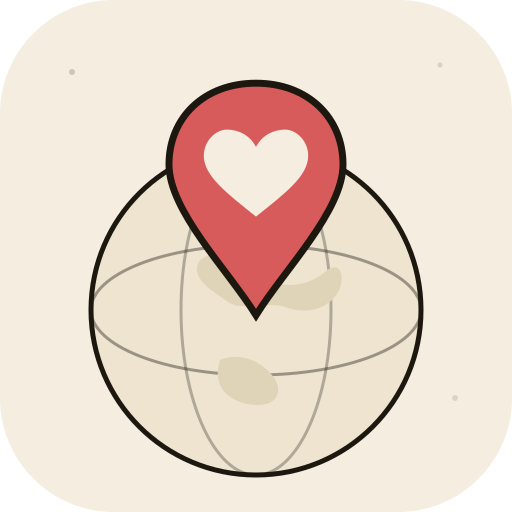

<div align="center">



# 우리가갈지도 (MayGo)

**커플의 장소 기억을 함께 모으고, 나누고, 발견하는 글로벌 데이트 지도 앱**

카카오톡 챗봇에 인스타 릴스를 공유하는 것만으로 AI가 장소를 자동 추출해  
Mapbox 3D 지구본 위에 핀을 꽂아줍니다.  
발견(REEL) · 설렘(WISH) · 추억(MEMORY) 세 가지 태그로 데이트 기록을 아카이빙하세요.

[](#)
[](#)
[](#)
[](#)
[](#)

</div>

---

## 주요 기능

### 카카오톡 챗봇 자동 핀 등록

카카오톡 채널 챗봇에 인스타그램 릴스 링크를 붙여넣으면, AI가 장소 정보를 자동 추출해 지도에 핀을 등록합니다.

- **AI 장소 추출** — Gemini 2.0 Flash가 인스타 캡션에서 장소명을 자동 파싱
- **국내/해외 통합 검색** — 카카오 Local API(국내 우선) → Google Places API(해외 폴백) 자동 전환
- **2초 룰 메모 자동 연결** — 릴스 링크 공유 직후 2초 내에 보낸 텍스트가 핀 메모로 자동 저장
- **장소 선택 카드** — 후보 장소가 여러 개일 때 카카오톡 리스트 카드로 직접 선택
- **레이트 리밋** — Bucket4j로 분당 10회 제한, 카카오 5초 타임아웃 내 전체 파이프라인 처리

### Mapbox 3D 글로벌 지도

Mapbox GL JS 기반의 3D 지구본 지도 위에 커플의 핀이 시각화됩니다.

- **3D 지구본 모드** — 줌 아웃 시 자동으로 3D 지구로 전환
- **파스텔 핀 마커** — REEL(연보라) · WISH(민트) · MEMORY(핑크) 3종 커스텀 SVG 마커
- **Supercluster 클러스터링** — 핀 밀집 영역에서 자동 묶음 표시, 클릭 시 해당 영역 줌인
- **AMOU 스타일 말풍선 팝업** — 핀 클릭 시 장소명 · 주소 · 메모 · 릴스 링크 표시
- **핀 공유 카드** — 말풍선 공유 아이콘 클릭 → Mapbox Static 배경 4:5 Canvas 카드 생성 후 클립보드 복사 또는 이미지 저장

### 태그 시스템 — REEL · WISH · MEMORY

장소의 의미를 세 가지 태그로 구분해 지도 맥락을 명확하게 표현합니다.

| 태그 | 표시명 | 의미 | 등록 경로 | 색상 |
|------|--------|------|-----------|------|
| `REEL` | 발견 | 릴스에서 발견한 장소 | 카카오톡 챗봇 (자동) | 연보라 `#C5B4E3` |
| `WISH` | 설렘 | 가보고 싶은 장소 | 웹 직접 등록 | 민트 `#A8E6CF` |
| `MEMORY` | 추억 | 함께 다녀온 의미 있는 장소 | 웹 직접 등록 | 핑크 `#FFB3C6` |

### 위치 기반 룰렛

"오늘 어디 갈까?" — 쌓아온 핀 중에서 지금 위치 기준으로 랜덤 추천합니다.

- **추천 반경** — 현재 위치 기준 10km 이내 장소 추천
- **Haversine 거리 계산** — PostGIS 없이 Java 레벨에서 처리 (50핀 규모 최적)
- **후보 풀** — REEL + WISH(아직 안 가본 곳) 위주 추천, MEMORY는 기본 제외
- **랜덤성 보장** — 5회 연속 동일 핀 추천 비율 ≤ 20%

### 그룹 공유 지도

초대 링크 한 번으로 커플의 공유 지도를 만들 수 있습니다.

- **초대 링크 기반 그룹 생성** — 24시간 유효 토큰으로 파트너 초대
- **핀/메모 그룹 격리** — 그룹 단위로 데이터 완전 분리 공유
- **N인 확장 가능 설계** — MVP는 2인 커플, `Group-GroupMember` 구조로 향후 N인 확장 지원
- **중복 방지** — 같은 릴스 URL이 같은 그룹에 두 번 등록되지 않음

### 인앱 알림

파트너가 새 핀을 등록하면 알림으로 확인할 수 있습니다.

- **자동 감지** — 앱 활성화(`visibilitychange` + `focus` + mount) 시 알림 목록 자동 갱신
- **알림 유형** — `CHATBOT_PINS`(릴스 자동 등록) · `MANUAL_PIN`(웹 직접 등록)
- **패널 UX** — 벨 아이콘 빨간 점 → 패널 열기 → 핀 클릭 시 지도 flyTo 이동
- **트랜잭션 격리** — 알림 실패가 핀 저장에 영향을 주지 않도록 `@Transactional` 분리

### 카카오 소셜 로그인

별도 회원가입 없이 카카오 계정으로 즉시 시작합니다.

- **카카오 OAuth2** — 별도 회원가입 절차 없음
- **JWT 쿠키 인증** — Access Token(1h) + Refresh Token(14일), HttpOnly Cookie
- **챗봇 연동 코드** — 웹에서 6자리 코드 발급(TTL 10분) → 카카오톡 챗봇에 입력해 계정 연동

### 운영 모니터링

1인 운영 환경에서 외부 API 장애를 사전에 감지합니다.

- **MDC RequestId** — 요청별 고유 ID 부여, Slack 알림에서 로그 역추적 1-step 가능
- **임계값 기반 Slack 알림** — Gemini 서버 에러율 10% · Instagram 차단율 50% 초과 시 자동 경보 (1시간 윈도우, 5분 쿨다운)
- **Google Places 한도 추적** — 일일 호출 95% 도달 시 사전 경고
- **일별 로그 회전** — Logback 90일 보관, gzip 압축
- **Micrometer 메트릭** — Prometheus + Grafana 대시보드 (로컬 모니터링 스택)

---

## 기술 스택

### Frontend

| 항목 | 버전 / 내용 |
|------|------------|
| Framework | Next.js 16.2.6 (App Router) |
| UI | React 19.2.4 + Tailwind CSS 4 |
| 언어 | TypeScript 5 |
| 지도 | Mapbox GL JS 3.8.0 |
| 클러스터링 | Supercluster 8.0.1 |
| 폰트 | Pretendard (self-host), Gowun Batang, Noto Serif KR |
| 테스트 | Vitest + React Testing Library |
| 배포 | Vercel |

### Backend

| 항목 | 버전 / 내용 |
|------|------------|
| 언어 | Java 21 (Eclipse Temurin) |
| Framework | Spring Boot 3.4.4 |
| 빌드 | Gradle 8.13 (Kotlin DSL, 멀티모듈) |
| DB | PostgreSQL 17 (Neon 관리형) |
| ORM | Spring Data JPA + QueryDSL |
| 캐시 | Caffeine (로컬 인메모리) — [ADR-0002](docs/adr/0002-redis-removal-caffeine.md) |
| 인증 | Spring Security + JJWT 0.12 |
| 레이트 리밋 | Bucket4j |
| 마이그레이션 | Flyway (V001~V007) |
| 테스트 | JUnit 5 + Testcontainers + WireMock |
| 배포 | AWS EC2 t3.micro (서울 리전) |

### 외부 API

| 서비스 | 용도 |
|--------|------|
| Kakao OAuth2 | 소셜 로그인 |
| Kakao i 오픈빌더 | 챗봇 Skill Webhook |
| Kakao Local API | 국내 장소 좌표 검색 |
| Google Places API | 해외 장소 검색 (카카오 폴백) |
| Google Gemini 2.0 Flash | 인스타 캡션 → 장소명 AI 추출 |
| Mapbox GL JS | 3D 지도 렌더링 |
| Slack Webhook | 운영 알림 (에러, 임계값 초과) |

### DevOps

| 항목 | 내용 |
|------|------|
| CI/CD | GitHub Actions |
| 컨테이너 | Docker (eclipse-temurin:21-jre-alpine) |
| 이미지 저장소 | GitHub Container Registry (ghcr.io) |
| DB | Neon PostgreSQL 17 (싱가포르 리전) |
| DNS / CDN | Cloudflare |
| Reverse Proxy | Nginx (EC2, 80 → 8080) |
| 모니터링 | Micrometer → Prometheus + Grafana |

---

## 로컬 개발 환경

### 요구사항

- Java 21
- Node.js 20+
- Docker Desktop

### 백엔드 실행

```bash
# 1. DB 컨테이너 실행
cd backend/docker
docker-compose -f infra-compose.yml up -d
# → PostgreSQL 17 on localhost:5432

# 2. 환경변수 설정 (backend/.env)

# 3. 백엔드 실행
cd backend
./gradlew :apps:wherewego-api:bootRun
# → http://localhost:8080
# → Swagger: http://localhost:8080/swagger-ui.html
```

### 프론트엔드 실행

```bash
cd frontend
npm install
npm run dev
# → http://localhost:3000
```

### 모니터링 스택 (선택)

```bash
cd backend/docker
docker-compose -f monitoring-compose.yml up -d
# → Prometheus: http://localhost:9090
# → Grafana:    http://localhost:3001
```

### 필수 환경변수 (backend/.env)

| 변수명 | 설명 |
|--------|------|
| `DATASOURCE_URL` | PostgreSQL JDBC URL |
| `DATASOURCE_USERNAME` | DB 사용자명 |
| `DATASOURCE_PASSWORD` | DB 비밀번호 |
| `JWT_SECRET` | JWT 서명 시크릿 |
| `KAKAO_CLIENT_ID` | 카카오 앱 키 |
| `KAKAO_CLIENT_SECRET` | 카카오 앱 시크릿 |
| `KAKAO_REDIRECT_URI` | OAuth2 콜백 URI |
| `KAKAO_SKILL_SECRET` | 챗봇 Skill Secret (44자, `=` 누락 주의) |
| `GOOGLE_PLACES_API_KEY` | Google Places API 키 |
| `GOOGLE_GEMINI_API_KEY` | Gemini API 키 |

### 프론트엔드 환경변수 (frontend/.env.local)

| 변수명 | 설명 |
|--------|------|
| `NEXT_PUBLIC_MAPBOX_TOKEN` | Mapbox 공개 토큰 |
| `NEXT_PUBLIC_MAPBOX_STYLE_URL` | Mapbox 커스텀 스타일 URL |
| `BACKEND_BASE_URL` | 백엔드 API 주소 (서버 컴포넌트 전용) |

---

## 프로젝트 구조

```
wherewego/
├── frontend/                   # Next.js 16 (App Router)
│   ├── app/                    # 페이지 라우트
│   ├── components/             # 공통 UI 컴포넌트
│   └── lib/
│       ├── design/tokens.ts    # 색상 · 폰트 디자인 토큰
│       ├── pin/markers.tsx     # REEL / WISH / MEMORY SVG 마커
│       └── share/              # Canvas 핀 공유 카드 생성
├── backend/                    # Spring Boot 3 (Gradle 멀티모듈)
│   ├── apps/wherewego-api/     # 메인 API 서버
│   │   └── domain/
│   │       ├── auth/           # 카카오 OAuth2 + JWT
│   │       ├── group/          # 그룹 생성 / 초대
│   │       ├── pin/            # 핀 CRUD + 중복 방지
│   │       ├── chatbot/        # Kakao Skill Webhook
│   │       ├── place/          # 인스타 스크래핑 + AI 추출
│   │       ├── memo/           # 메모 (2초 룰)
│   │       ├── tag/            # REEL / WISH / MEMORY
│   │       ├── recommendation/ # 위치 기반 룰렛 (Haversine)
│   │       └── notification/   # 인앱 알림
│   ├── modules/jpa/            # BaseEntity, JPA 공통 설정
│   └── supports/
│       ├── logging/            # Logback + 파일 롤링 + Slack 알림
│       └── monitoring/         # Micrometer Prometheus
├── context/                    # 도메인 컨텍스트 문서
├── docs/                       # ADR, 아키텍처 문서
└── .github/workflows/          # CI/CD (deploy.yml)
```

---

## 구현 현황

| Phase | 범위 | 상태 |
|-------|------|------|
| Phase 0 | DB 스키마(V001) + Spring Boot 멀티모듈 기반 | ✅ |
| Phase 1 | 카카오 OAuth2 + JWT 세션 | ✅ |
| Phase 2 | 챗봇 Webhook + 인스타 파이프라인 | ✅ |
| Phase 2.5 | Gemini 2.0 Flash 장소명 추출 전환 | ✅ |
| Phase 3 | 그룹 생성 / 초대 / 탈퇴 | ✅ |
| Phase 4 | 웹 UI 핀 CRUD | ✅ |
| Phase 5 | Google Places 해외 장소 비동기 폴백 | ✅ |
| Phase 6 | Mapbox 3D 지도 + 파스텔 핀 UI + 위치 기반 룰렛 | ✅ |
| Phase 2.6 | UX 완성 · 보안 안정화 (SameSite Lax, Bucket4j) | ✅ |
| Phase 2.7 | 테스트 자동화 28건 (E2E · 동시성 · WireMock) | ✅ |
| Phase 2.8 | 핀 도메인 UX 완성 (Instagram URL · 장소 수정) | ✅ |
| Phase 2.9 | 페이지네이션 계약 준비 + Mapbox GL 마이그레이션 분석 | ✅ |
| Phase 2.10 | 핀 좌표 수정 · 챗봇 플로우 검증 · Mapbox 토큰 SOP | ✅ |
| Phase 2.11 | Observability: MDC + 외부 API 구조화 로그 + Slack 임계값 알림 | ✅ |
| Phase 7 | 태그 3종 리뉴얼: REEL · WISH · MEMORY + 지도 마커 신설 | ✅ |
| Phase 8 | 인앱 알림: 그룹원 핀 등록 시 fetch 트리거 알림 + 패널 UI | ✅ |
| Phase 9 | 핀 공유 카드: Canvas 4:5 카드 + 클립보드 복사 / 이미지 저장 | ✅ |

---

## 문서

- [프로젝트 전체 정리](docs/PROJECT_OVERVIEW.md)
- [시스템 아키텍처](docs/ARCHITECTURE.md)
- [기술 스택 상세](docs/TECH.md)
- [인프라 구축 가이드](docs/INFRA_SETUP.md)
- [챗봇 설정 가이드](docs/CHATBOT_SETUP_GUIDE.md)
- [ERD](docs/ERD.md)
- [ADR-0001 Redis/Kafka 검토](docs/adr/0001-redis-kafka-usage.md)
- [ADR-0002 Redis → Caffeine 전환](docs/adr/0002-redis-removal-caffeine.md)
- [도메인 컨텍스트](context/README.md)

---

<div align="center">

1인 개발 — rnqhstmd

</div>
