# 시스템 아키텍처

> 최종 업데이트: 2026-05-20

---

## 전체 시스템 구조

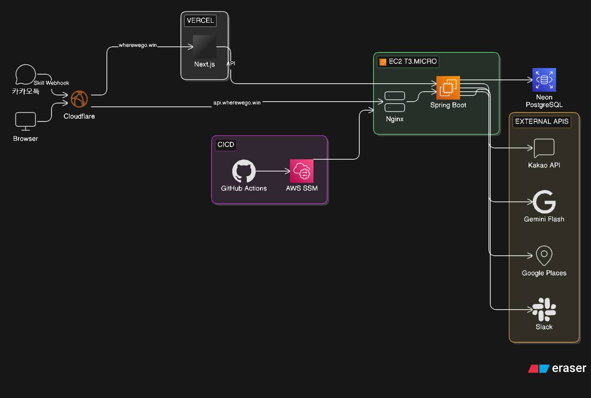

---

## 백엔드 모듈 구조

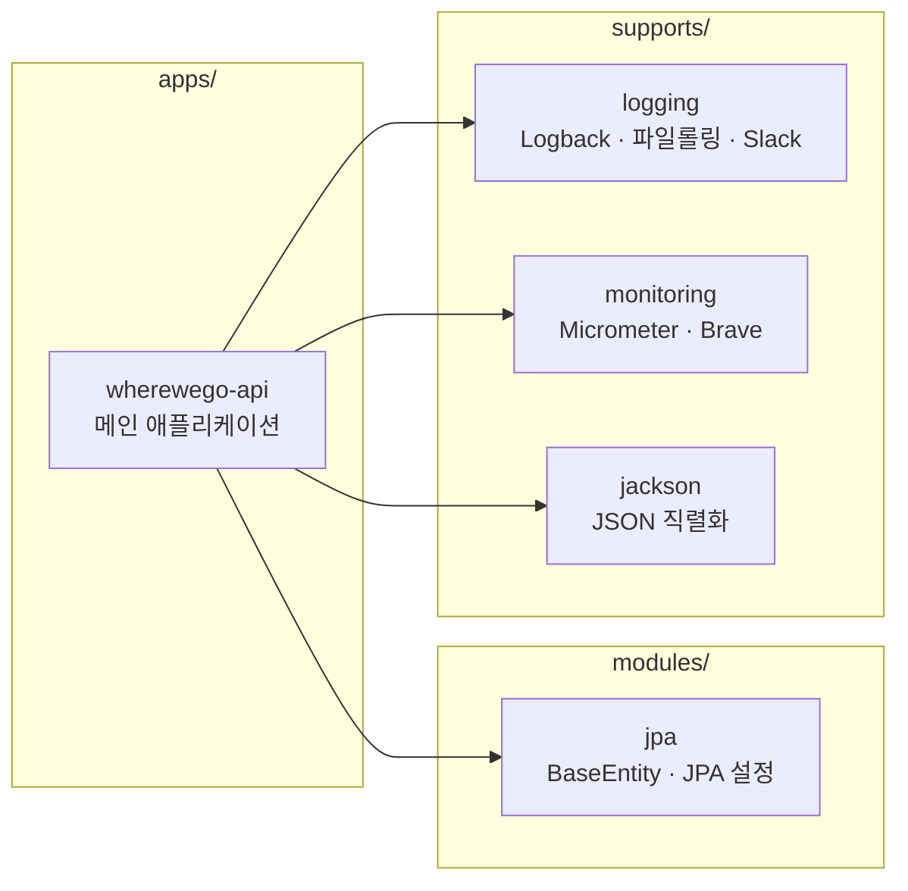
```mermaid
graph LR
    subgraph Apps["apps/"]
        API["wherewego-api\n메인 애플리케이션"]
    end

    subgraph Modules["modules/"]
        JPA["jpa\nBaseEntity · JPA 설정"]
    end

    subgraph Supports["supports/"]
        LOG["logging\nLogback · 파일롤링 · Slack"]
        MON["monitoring\nMicrometer · Brave"]
        JAK["jackson\nJSON 직렬화"]
    end

    API --> JPA
    API --> LOG
    API --> MON
    API --> JAK
```

---

## 인스타 릴스 → 핀 등록 시퀀스

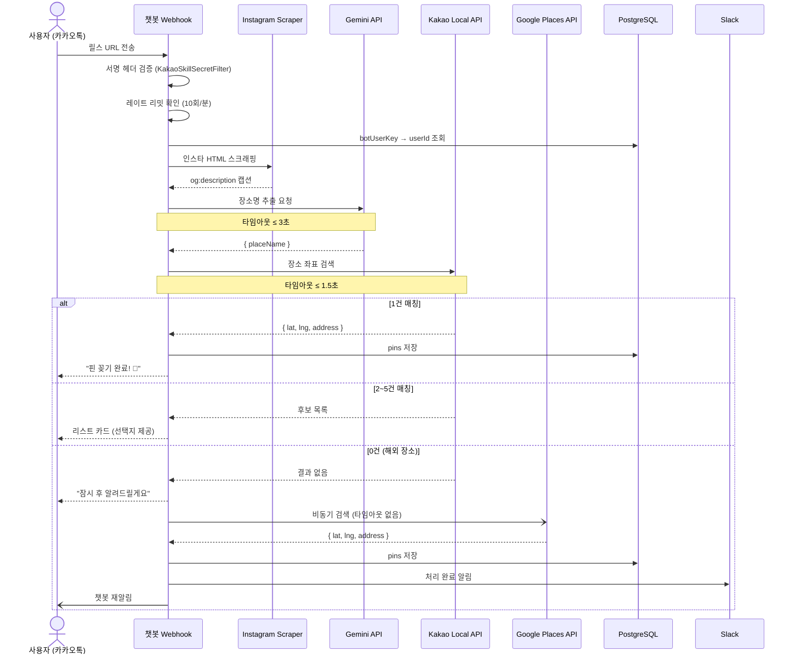
```mermaid
sequenceDiagram
    actor User as 사용자 (카카오톡)
    participant CB as 챗봇 Webhook
    participant IG as Instagram Scraper
    participant AI as Gemini API
    participant KL as Kakao Local API
    participant GP as Google Places API
    participant DB as PostgreSQL
    participant Slack as Slack

    User->>CB: 릴스 URL 전송
    CB->>CB: 서명 헤더 검증 (KakaoSkillSecretFilter)
    CB->>CB: 레이트 리밋 확인 (10회/분)
    CB->>DB: botUserKey → userId 조회

    CB->>IG: 인스타 HTML 스크래핑
    IG-->>CB: og:description 캡션

    CB->>AI: 장소명 추출 요청
    Note over CB,AI: 타임아웃 ≤ 3초
    AI-->>CB: { placeName }

    CB->>KL: 장소 좌표 검색
    Note over CB,KL: 타임아웃 ≤ 1.5초

    alt 1건 매칭
        KL-->>CB: { lat, lng, address }
        CB->>DB: pins 저장
        CB-->>User: "핀 꽂기 완료! 📍"
    else 2~5건 매칭
        KL-->>CB: 후보 목록
        CB-->>User: 리스트 카드 (선택지 제공)
    else 0건 (해외 장소)
        KL-->>CB: 결과 없음
        CB-->>User: "잠시 후 알려드릴게요"
        CB-)GP: 비동기 검색 (타임아웃 없음)
        GP-->>CB: { lat, lng, address }
        CB->>DB: pins 저장
        CB->>Slack: 처리 완료 알림
        CB-)User: 챗봇 재알림
    end
```

---

## 카카오 OAuth2 인증 흐름

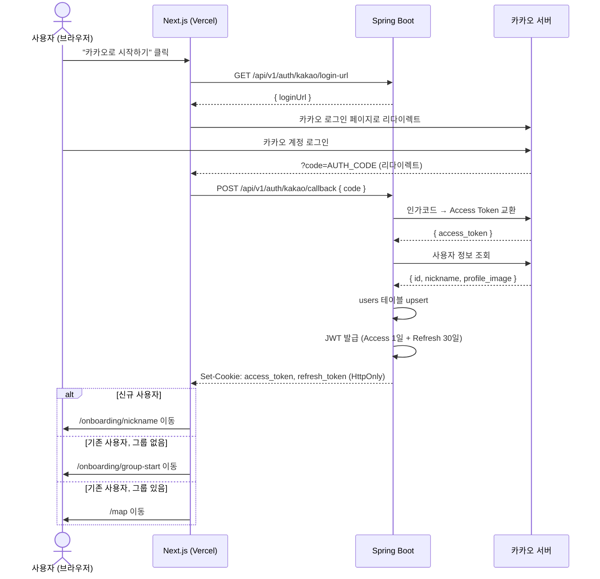
```mermaid
sequenceDiagram
    actor User as 사용자 (브라우저)
    participant FE as Next.js (Vercel)
    participant BE as Spring Boot
    participant Kakao as 카카오 서버

    User->>FE: "카카오로 시작하기" 클릭
    FE->>BE: GET /api/v1/auth/kakao/login-url
    BE-->>FE: { loginUrl }
    FE->>Kakao: 카카오 로그인 페이지로 리다이렉트

    User->>Kakao: 카카오 계정 로그인
    Kakao-->>FE: ?code=AUTH_CODE (리다이렉트)

    FE->>BE: POST /api/v1/auth/kakao/callback { code }
    BE->>Kakao: 인가코드 → Access Token 교환
    Kakao-->>BE: { access_token }
    BE->>Kakao: 사용자 정보 조회
    Kakao-->>BE: { id, nickname, profile_image }
    BE->>BE: users 테이블 upsert
    BE->>BE: JWT 발급 (Access 1일 + Refresh 30일)
    BE-->>FE: Set-Cookie: access_token, refresh_token (HttpOnly)

    alt 신규 사용자
        FE->>User: /onboarding/nickname 이동
    else 기존 사용자, 그룹 없음
        FE->>User: /onboarding/group-start 이동
    else 기존 사용자, 그룹 있음
        FE->>User: /map 이동
    end
```

---

## 챗봇 연동 코드 흐름

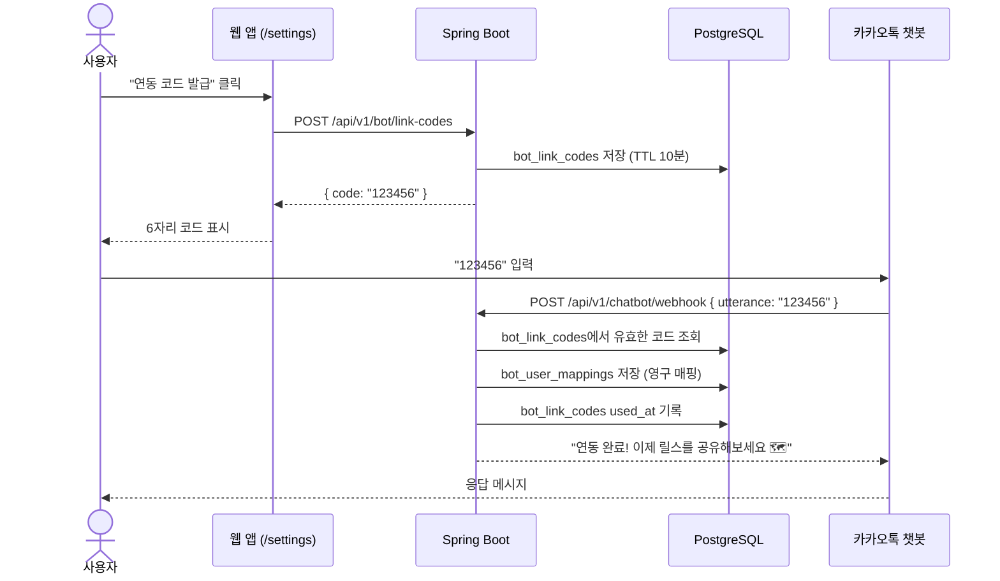
```mermaid
sequenceDiagram
    actor User as 사용자
    participant Web as 웹 앱 (/settings)
    participant BE as Spring Boot
    participant DB as PostgreSQL
    participant KakaoBot as 카카오톡 챗봇

    User->>Web: "연동 코드 발급" 클릭
    Web->>BE: POST /api/v1/bot/link-codes
    BE->>DB: bot_link_codes 저장 (TTL 10분)
    BE-->>Web: { code: "123456" }
    Web-->>User: 6자리 코드 표시

    User->>KakaoBot: "123456" 입력
    KakaoBot->>BE: POST /api/v1/chatbot/webhook { utterance: "123456" }
    BE->>DB: bot_link_codes에서 유효한 코드 조회
    BE->>DB: bot_user_mappings 저장 (영구 매핑)
    BE->>DB: bot_link_codes used_at 기록
    BE-->>KakaoBot: "연동 완료! 이제 릴스를 공유해보세요 🗺️"
    KakaoBot-->>User: 응답 메시지
```

---

## 프론트엔드 라우팅 구조

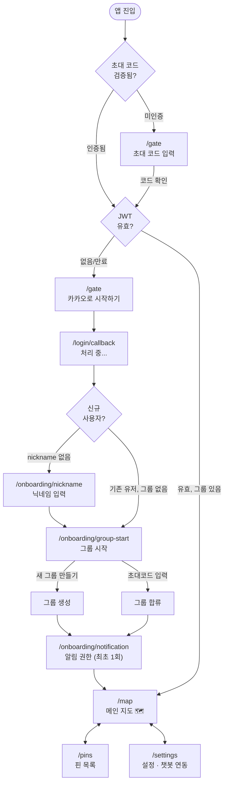
```mermaid
flowchart TD
    Start([앱 진입]) --> Gate{초대 코드\n검증됨?}

    Gate -->|미인증| GatePage["/gate\n초대 코드 입력"]
    Gate -->|인증됨| JwtCheck{JWT\n유효?}

    GatePage -->|코드 확인| JwtCheck
    JwtCheck -->|없음/만료| Login["/gate\n카카오로 시작하기"]
    Login --> Callback["/login/callback\n처리 중..."]

    Callback --> UserCheck{신규\n사용자?}
    UserCheck -->|nickname 없음| Nickname["/onboarding/nickname\n닉네임 입력"]
    Nickname --> GroupStart["/onboarding/group-start\n그룹 시작"]
    UserCheck -->|기존 유저, 그룹 없음| GroupStart

    GroupStart --> |새 그룹 만들기| CreateGroup["그룹 생성"]
    GroupStart --> |초대코드 입력| JoinGroup["그룹 합류"]
    CreateGroup --> Notif["/onboarding/notification\n알림 권한 (최초 1회)"]
    JoinGroup --> Notif
    Notif --> Map

    JwtCheck -->|유효, 그룹 있음| Map["/map\n메인 지도 🗺️"]

    Map <--> Pins["/pins\n핀 목록"]
    Map <--> Settings["/settings\n설정 · 챗봇 연동"]
```

---

## 배포 파이프라인

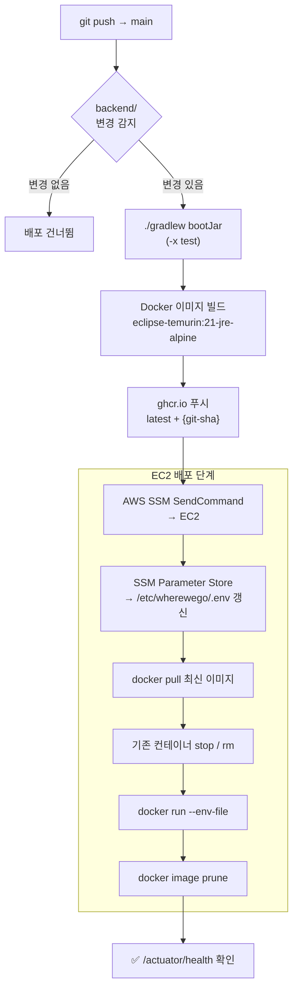
```mermaid
flowchart TD
    Push["git push → main"] --> Detect{backend/\n변경 감지}
    Detect -->|변경 없음| Skip["배포 건너뜀"]
    Detect -->|변경 있음| Build

    Build["./gradlew bootJar\n(-x test)"] --> Docker["Docker 이미지 빌드\neclipse-temurin:21-jre-alpine"]
    Docker --> Push2["ghcr.io 푸시\nlatest + {git-sha}"]

    Push2 --> SSM["AWS SSM SendCommand\n→ EC2"]

    subgraph EC2["EC2 배포 단계"]
        SSM --> EnvUpdate["SSM Parameter Store\n→ /etc/wherewego/.env 갱신"]
        EnvUpdate --> Pull["docker pull 최신 이미지"]
        Pull --> Stop["기존 컨테이너 stop / rm"]
        Stop --> Run["docker run --env-file"]
        Run --> Prune["docker image prune"]
    end

    Prune --> Health["✅ /actuator/health 확인"]
```

---

## 메모 입력 대기 흐름

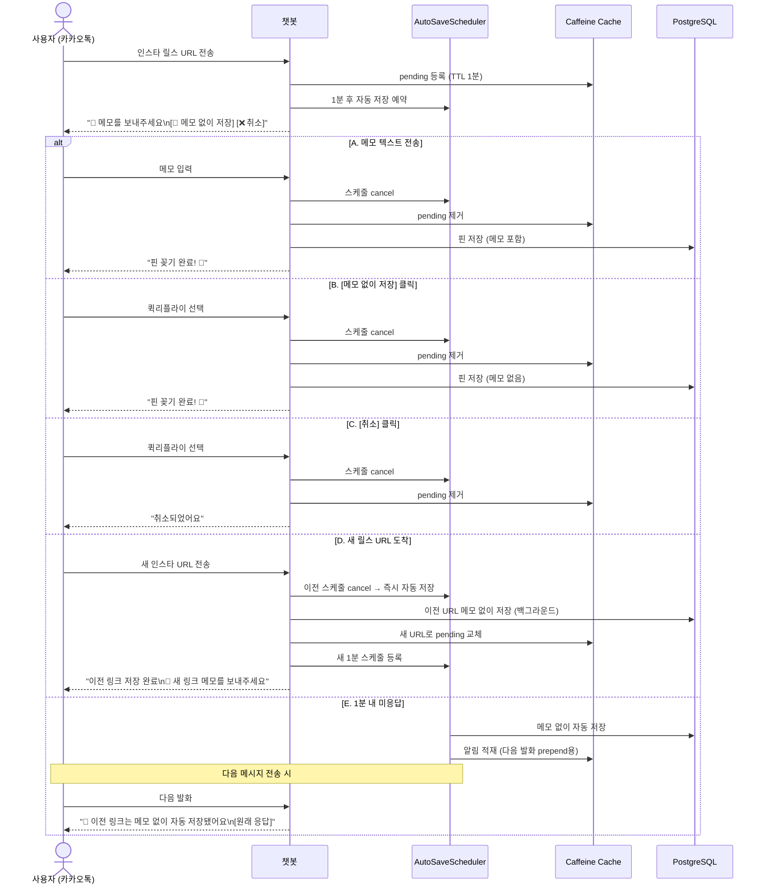
```mermaid
sequenceDiagram
    actor User as 사용자 (카카오톡)
    participant CB as 챗봇
    participant Scheduler as AutoSaveScheduler
    participant Cache as Caffeine Cache
    participant DB as PostgreSQL

    User->>CB: 인스타 릴스 URL 전송
    CB->>Cache: pending 등록 (TTL 1분)
    CB->>Scheduler: 1분 후 자동 저장 예약
    CB-->>User: "📝 메모를 보내주세요\n[💾 메모 없이 저장] [❌ 취소]"

    alt A. 메모 텍스트 전송
        User->>CB: 메모 입력
        CB->>Scheduler: 스케줄 cancel
        CB->>Cache: pending 제거
        CB->>DB: 핀 저장 (메모 포함)
        CB-->>User: "핀 꽂기 완료! 📍"

    else B. [메모 없이 저장] 클릭
        User->>CB: 퀵리플라이 선택
        CB->>Scheduler: 스케줄 cancel
        CB->>Cache: pending 제거
        CB->>DB: 핀 저장 (메모 없음)
        CB-->>User: "핀 꽂기 완료! 📍"

    else C. [취소] 클릭
        User->>CB: 퀵리플라이 선택
        CB->>Scheduler: 스케줄 cancel
        CB->>Cache: pending 제거
        CB-->>User: "취소되었어요"

    else D. 새 릴스 URL 도착
        User->>CB: 새 인스타 URL 전송
        CB->>Scheduler: 이전 스케줄 cancel → 즉시 자동 저장
        CB->>DB: 이전 URL 메모 없이 저장 (백그라운드)
        CB->>Cache: 새 URL로 pending 교체
        CB->>Scheduler: 새 1분 스케줄 등록
        CB-->>User: "이전 링크 저장 완료\n📝 새 링크 메모를 보내주세요"

    else E. 1분 내 미응답
        Scheduler->>DB: 메모 없이 자동 저장
        Scheduler->>Cache: 알림 적재 (다음 발화 prepend용)
        Note over User,Scheduler: 다음 메시지 전송 시
        User->>CB: 다음 발화
        CB-->>User: "📌 이전 링크는 메모 없이 자동 저장됐어요\n[원래 응답]"
    end
```

---

## 관찰 가능성 구조

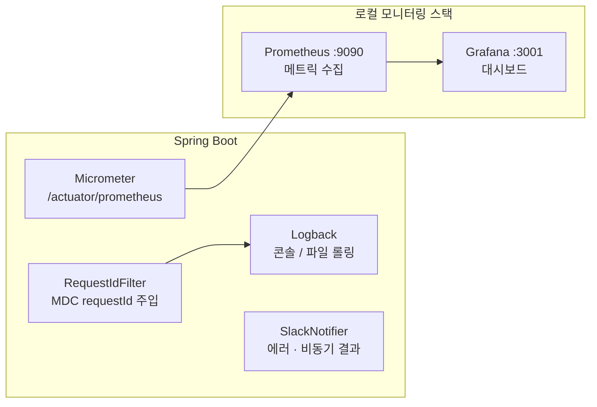
```mermaid
graph LR
    subgraph App["Spring Boot"]
        RF["RequestIdFilter\nMDC requestId 주입"]
        LOG["Logback\n콘솔 / 파일 롤링"]
        MET["Micrometer\n/actuator/prometheus"]
        SLACK["SlackNotifier\n에러 · 비동기 결과"]
    end

    subgraph Local["로컬 모니터링 스택"]
        PROM["Prometheus :9090\n메트릭 수집"]
        GF["Grafana :3001\n대시보드"]
    end

    RF --> LOG
    MET --> PROM
    PROM --> GF
    App --> SLACK
```

---

## JWT 토큰 갱신 흐름

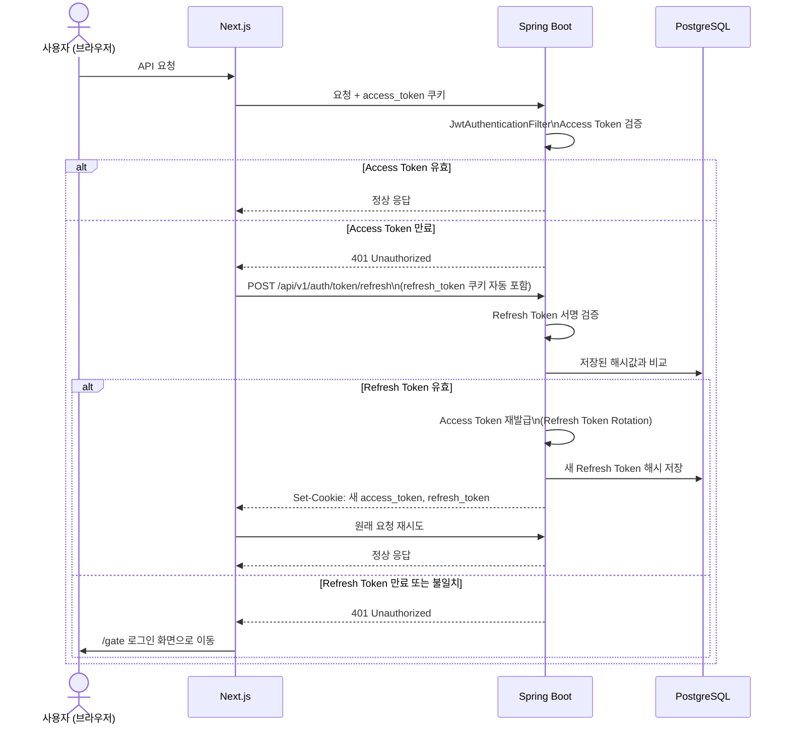
```mermaid
sequenceDiagram
    actor User as 사용자 (브라우저)
    participant FE as Next.js
    participant BE as Spring Boot
    participant DB as PostgreSQL

    User->>FE: API 요청
    FE->>BE: 요청 + access_token 쿠키
    BE->>BE: JwtAuthenticationFilter\nAccess Token 검증

    alt Access Token 유효
        BE-->>FE: 정상 응답
    else Access Token 만료
        BE-->>FE: 401 Unauthorized
        FE->>BE: POST /api/v1/auth/token/refresh\n(refresh_token 쿠키 자동 포함)
        BE->>BE: Refresh Token 서명 검증
        BE->>DB: 저장된 해시값과 비교
        alt Refresh Token 유효
            BE->>BE: Access Token 재발급\n(Refresh Token Rotation)
            BE->>DB: 새 Refresh Token 해시 저장
            BE-->>FE: Set-Cookie: 새 access_token, refresh_token
            FE->>BE: 원래 요청 재시도
            BE-->>FE: 정상 응답
        else Refresh Token 만료 또는 불일치
            BE-->>FE: 401 Unauthorized
            FE->>User: /gate 로그인 화면으로 이동
        end
    end
```

---

## 그룹 초대 흐름

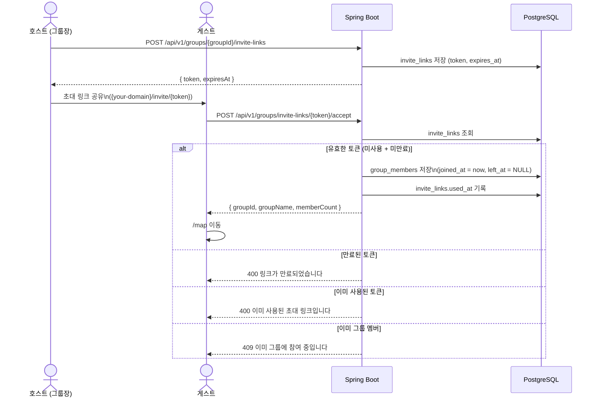
```mermaid
sequenceDiagram
    actor Host as 호스트 (그룹장)
    actor Guest as 게스트
    participant BE as Spring Boot
    participant DB as PostgreSQL

    Host->>BE: POST /api/v1/groups/{groupId}/invite-links
    BE->>DB: invite_links 저장 (token, expires_at)
    BE-->>Host: { token, expiresAt }
    Host->>Guest: 초대 링크 공유\n({your-domain}/invite/{token})

    Guest->>BE: POST /api/v1/groups/invite-links/{token}/accept
    BE->>DB: invite_links 조회
    alt 유효한 토큰 (미사용 + 미만료)
        BE->>DB: group_members 저장\n(joined_at = now, left_at = NULL)
        BE->>DB: invite_links.used_at 기록
        BE-->>Guest: { groupId, groupName, memberCount }
        Guest->>Guest: /map 이동
    else 만료된 토큰
        BE-->>Guest: 400 링크가 만료되었습니다
    else 이미 사용된 토큰
        BE-->>Guest: 400 이미 사용된 초대 링크입니다
    else 이미 그룹 멤버
        BE-->>Guest: 409 이미 그룹에 참여 중입니다
    end
```

---

## 장소 검색 폴백 전략

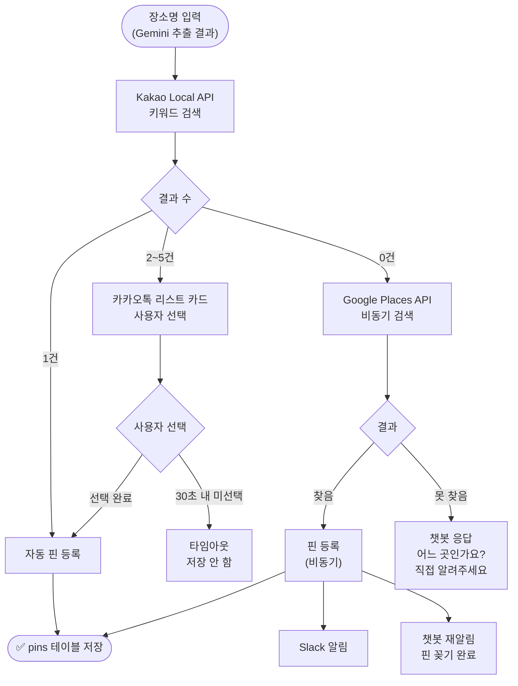
```mermaid
flowchart TD
    Start(["장소명 입력\n(Gemini 추출 결과)"])

    Start --> KakaoSearch["Kakao Local API\n키워드 검색"]

    KakaoSearch --> KakaoResult{결과 수}

    KakaoResult -->|"1건"| AutoPin["자동 핀 등록"]
    KakaoResult -->|"2~5건"| UserSelect["카카오톡 리스트 카드\n사용자 선택"]
    KakaoResult -->|"0건"| GoogleFallback

    UserSelect --> UserPick{사용자 선택}
    UserPick -->|"선택 완료"| AutoPin
    UserPick -->|"30초 내 미선택"| Timeout["타임아웃\n저장 안 함"]

    GoogleFallback["Google Places API\n비동기 검색"]
    GoogleFallback --> GoogleResult{결과}

    GoogleResult -->|"찾음"| AsyncPin["핀 등록\n(비동기)"]
    GoogleResult -->|"못 찾음"| ManualAsk["챗봇 응답\n어느 곳인가요?\n직접 알려주세요"]

    AsyncPin --> SlackNotify["Slack 알림"]
    AsyncPin --> BotNotify["챗봇 재알림\n핀 꽂기 완료"]

    AutoPin --> Done(["✅ pins 테이블 저장"])
    AsyncPin --> Done
```

---

## 보안 필터 체인

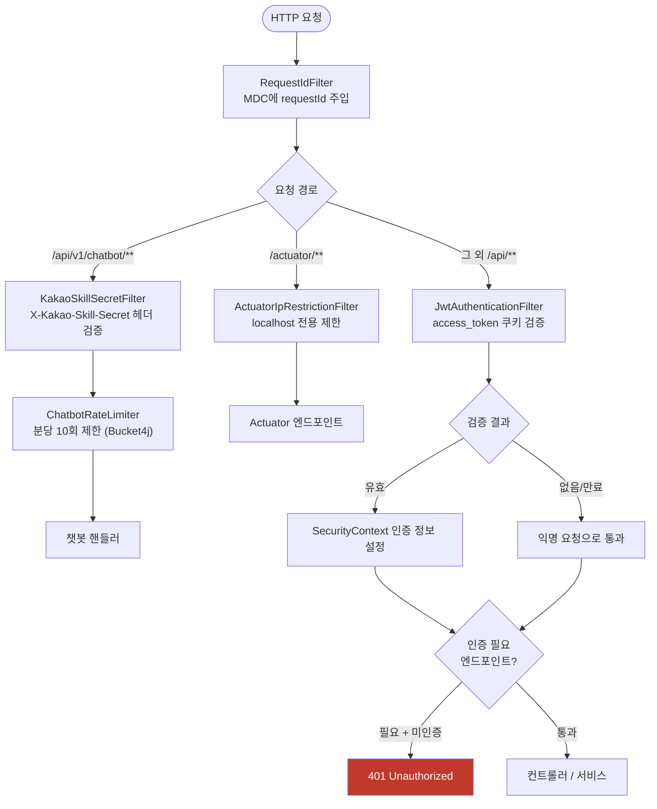
```mermaid
flowchart TD
    Req(["HTTP 요청"]) --> RIF["RequestIdFilter\nMDC에 requestId 주입"]

    RIF --> PathCheck{요청 경로}

    PathCheck -->|"/api/v1/chatbot/**"| KSF["KakaoSkillSecretFilter\nX-Kakao-Skill-Secret 헤더 검증"]
    KSF --> CRL["ChatbotRateLimiter\n분당 10회 제한 (Bucket4j)"]
    CRL --> ChatbotHandler["챗봇 핸들러"]

    PathCheck -->|"/actuator/**"| AIR["ActuatorIpRestrictionFilter\nlocalhost 전용 제한"]
    AIR --> ActuatorHandler["Actuator 엔드포인트"]

    PathCheck -->|"그 외 /api/**"| JWT["JwtAuthenticationFilter\naccess_token 쿠키 검증"]
    JWT --> JWTResult{검증 결과}
    JWTResult -->|"유효"| SecurityCtx["SecurityContext 인증 정보 설정"]
    JWTResult -->|"없음/만료"| Anonymous["익명 요청으로 통과"]

    SecurityCtx --> AuthCheck{인증 필요\n엔드포인트?}
    Anonymous --> AuthCheck
    AuthCheck -->|"필요 + 미인증"| Reject["401 Unauthorized"]
    AuthCheck -->|"통과"| Handler["컨트롤러 / 서비스"]

    style Reject fill:#c0392b,color:#fff
```

---

## 핀 CRUD 시퀀스

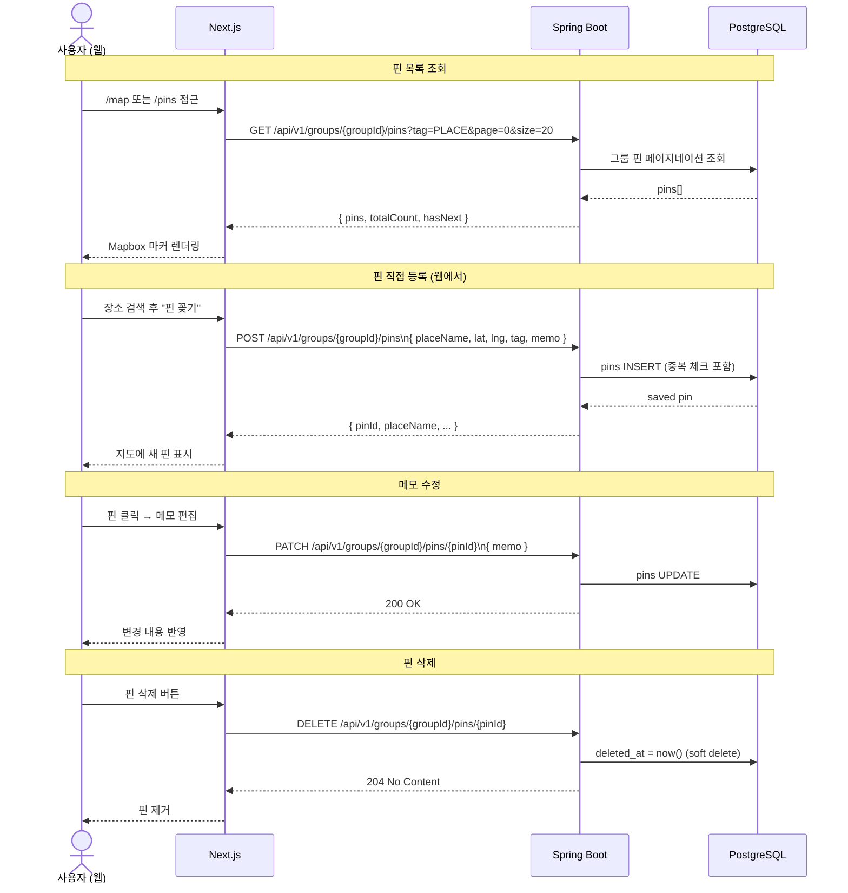
```mermaid
sequenceDiagram
    actor User as 사용자 (웹)
    participant FE as Next.js
    participant BE as Spring Boot
    participant DB as PostgreSQL

    Note over User,DB: 핀 목록 조회
    User->>FE: /map 또는 /pins 접근
    FE->>BE: GET /api/v1/groups/{groupId}/pins?tag=PLACE&page=0&size=20
    BE->>DB: 그룹 핀 페이지네이션 조회
    DB-->>BE: pins[]
    BE-->>FE: { pins, totalCount, hasNext }
    FE-->>User: Mapbox 마커 렌더링

    Note over User,DB: 핀 직접 등록 (웹에서)
    User->>FE: 장소 검색 후 "핀 꽂기"
    FE->>BE: POST /api/v1/groups/{groupId}/pins\n{ placeName, lat, lng, tag, memo }
    BE->>DB: pins INSERT (중복 체크 포함)
    DB-->>BE: saved pin
    BE-->>FE: { pinId, placeName, ... }
    FE-->>User: 지도에 새 핀 표시

    Note over User,DB: 메모 수정
    User->>FE: 핀 클릭 → 메모 편집
    FE->>BE: PATCH /api/v1/groups/{groupId}/pins/{pinId}\n{ memo }
    BE->>DB: pins UPDATE
    BE-->>FE: 200 OK
    FE-->>User: 변경 내용 반영

    Note over User,DB: 핀 삭제
    User->>FE: 핀 삭제 버튼
    FE->>BE: DELETE /api/v1/groups/{groupId}/pins/{pinId}
    BE->>DB: deleted_at = now() (soft delete)
    BE-->>FE: 204 No Content
    FE-->>User: 핀 제거
```

---

## 위치 기반 룰렛 추천 흐름

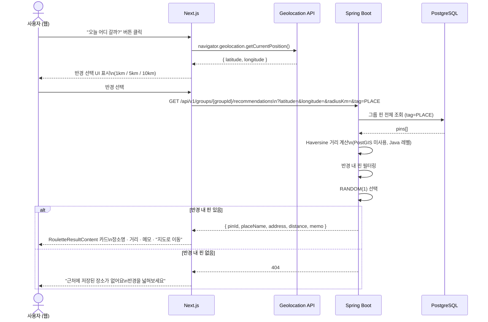
```mermaid
sequenceDiagram
    actor User as 사용자 (웹)
    participant FE as Next.js
    participant GEO as Geolocation API
    participant BE as Spring Boot
    participant DB as PostgreSQL

    User->>FE: "오늘 어디 갈까?" 버튼 클릭
    FE->>GEO: navigator.geolocation.getCurrentPosition()
    GEO-->>FE: { latitude, longitude }

    FE-->>User: 반경 선택 UI 표시\n(1km / 5km / 10km)
    User->>FE: 반경 선택

    FE->>BE: GET /api/v1/groups/{groupId}/recommendations\n?latitude=&longitude=&radiusKm=&tag=PLACE
    BE->>DB: 그룹 핀 전체 조회 (tag=PLACE)
    DB-->>BE: pins[]

    BE->>BE: Haversine 거리 계산\n(PostGIS 미사용, Java 레벨)
    BE->>BE: 반경 내 핀 필터링
    BE->>BE: RANDOM(1) 선택

    alt 반경 내 핀 있음
        BE-->>FE: { pinId, placeName, address, distance, memo }
        FE-->>User: RouletteResultContent 카드\n장소명 · 거리 · 메모 · "지도로 이동"
    else 반경 내 핀 없음
        BE-->>FE: 404
        FE-->>User: "근처에 저장된 장소가 없어요\n반경을 넓혀보세요"
    end
```
