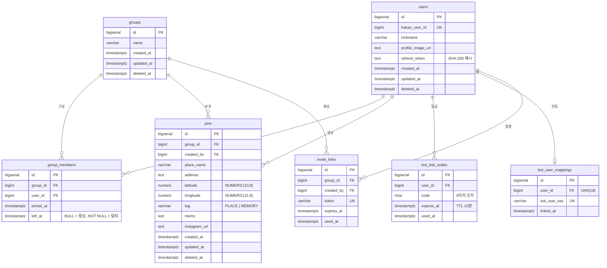

# ERD (Entity-Relationship Diagram)

> 최종 업데이트: 2026-05-20  
> DB: PostgreSQL 17 (Neon), Flyway V001~V005 자동 적용

---

## 전체 ERD

---

## 테이블 상세

### users
카카오 소셜 로그인으로 생성되는 사용자 계정.

| 컬럼 | 타입 | 설명 |
|------|------|------|
| `id` | BIGSERIAL PK | 내부 식별자 |
| `kakao_user_id` | BIGINT UNIQUE | 카카오에서 발급하는 사용자 ID |
| `nickname` | VARCHAR(100) | 앱 내 닉네임 (온보딩 시 입력) |
| `profile_image_url` | TEXT | 카카오 프로필 이미지 URL |
| `refresh_token` | TEXT | JWT Refresh Token SHA-256 해시값 |

### groups
커플/소그룹 단위의 핀 공유 공간.

| 컬럼 | 타입 | 설명 |
|------|------|------|
| `id` | BIGSERIAL PK | 그룹 식별자 |
| `name` | VARCHAR(100) | 그룹 이름 |

### group_members
유저-그룹 N:M 관계. `left_at IS NULL`인 레코드가 활성 멤버십.

| 제약 | 내용 |
|------|------|
| UNIQUE | `(group_id, user_id)` |
| UNIQUE INDEX | `(user_id) WHERE left_at IS NULL` — 한 유저가 동시에 하나의 그룹만 활성화 |

### pins
지도 위에 표시되는 장소 핀. 핵심 엔티티.

| 컬럼 | 타입 | 설명 |
|------|------|------|
| `tag` | VARCHAR | `PLACE`(방문 예정) 또는 `MEMORY`(방문 완료) |
| `instagram_url` | TEXT | 릴스 출처 URL |
| `latitude / longitude` | NUMERIC | 소수점 8자리 좌표 |

| 제약 | 내용 |
|------|------|
| UNIQUE | `(group_id, instagram_url)` — 같은 그룹 내 릴스 중복 등록 방지 |

### bot_link_codes
카카오톡 챗봇과 웹 계정을 연동하는 일회용 코드.

- 6자리 숫자, TTL 10분
- 사용 완료 시 `used_at` 기록

### bot_user_mappings
연동 완료 후 `bot_user_key` ↔ `user_id` 영구 매핑 테이블.

- `user_id` UNIQUE: 한 사용자 당 하나의 챗봇 연동
- `bot_user_key` UNIQUE: 카카오 오픈빌더 사용자 식별 키

### invite_links
그룹 초대용 일회성 링크.

- `token`: URL-safe 랜덤 문자열
- 사용 완료(`used_at`) 또는 만료(`expires_at`) 후 무효화
